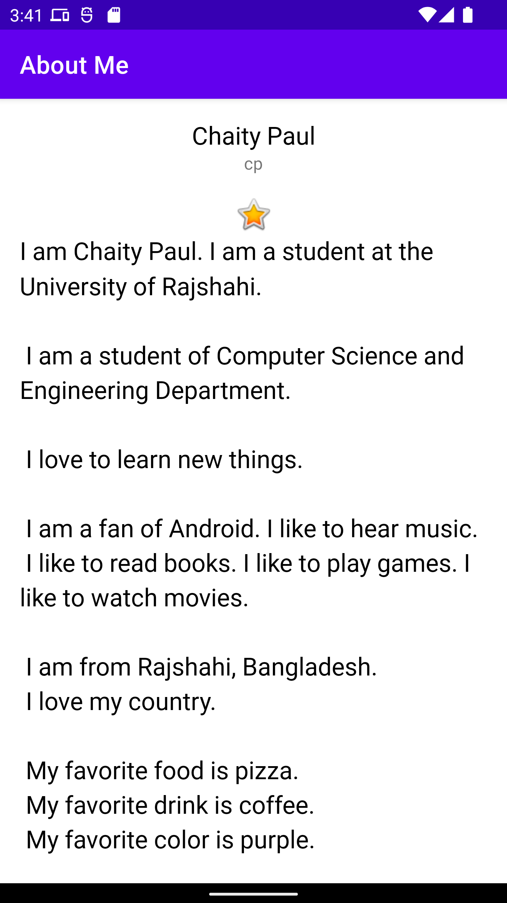

<h1 align="center">About Me (Android App with Scrollbar & LinearLayout)</h1>

## Built With
- [Android Studio](https://developer.android.com/studio)
- [Kotlin](https://developer.android.com/kotlin)
- Github Copilot

## Features
- Setting of a Nickname
- Scrolling

## Preview
- Suppose, if we set the nickname 'cp', then the app will run like this :

 
   
   

